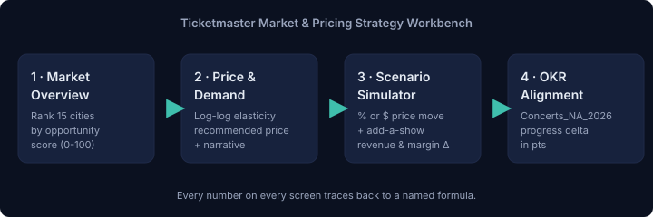

# Ticketmaster Market & Pricing Strategy Workbench

A working strategy product built as a portfolio piece for the
**Manager, Strategy — Ticketmaster** role
([job posting](https://livenation.wd503.myworkdayjobs.com/en-US/LNExternalSite/job/Beverly-Hills-CA-USA/Manager--Strategy_JR-93190?source=LinkedIn)).

Instead of one more deck, this repository is the deck — a runnable
strategy cockpit that takes event data (city, venue, prices, costs, demand
signals) and answers three questions the strategy team gets every week:

1. **Which markets should we prioritize?** — a Market Overview with a
   0–100 opportunity score per city.
2. **What should we charge?** — a log-log price-elasticity model with a
   contribution-margin-maximizing recommendation per event.
3. **How does a decision move the OKR?** — a scenario simulator that
   projects revenue, contribution margin, and progress against the
   `Concerts_NA_2026` annual revenue target.



The workbench is small on purpose: SQLite + FastAPI + a
zero-tooling vanilla-JS frontend, all in one repo. It runs in under 30 seconds
from a fresh clone, and every number on every screen traces back to a
named formula in `backend/services/`.

---

## Why this project — mapped to the JD

The Manager, Strategy role calls for:

| JD requirement | How the workbench demonstrates it |
| :--- | :--- |
| **Market assessments & financial modeling** | 15-city arena tour with per-event revenue, variable cost, fixed cost allocation, and contribution margin — the same shape a tour P&L would take internally. See `backend/services/metrics.py` and `backend/sql/event_economics.sql`. |
| **Analytical toolset — SQL + Python + BI-style dashboards** | Analytical logic is expressed twice: once as Python services powering the API, once as portable SQL in `backend/sql/`. The frontend is a three-view dashboard with sortable tables, KPI cards, and interactive charts — the same primitives a Tableau/Power BI board would provide. |
| **Regression & scenario modeling** | Explicit log-log price elasticity fit (`fit_log_log`) with per-event elasticities recovered from a synthetic panel, and a full scenario simulator that projects revenue, margin, and OKR progress against a baseline. |
| **Media & live-entertainment context** | Data model is grounded in tours, venues, price tiers (Nosebleed / Standard / Premium / VIP), face value vs sales-weighted average price, sell-through, and demand signals (page views, unique visitors, cart adds, search intent). |
| **OKR monitoring & storytelling** | Segment-level OKR view mapping actuals to annual targets, plus a natural-language narrative attached to every elasticity and scenario response — the copy that goes on the deck slide, generated from the numbers instead of typed by hand. |
| **Turning insight into a product** | This is not a report — it's a tool. A strategy manager runs a scenario in ~15 seconds and gets revenue Δ, margin Δ, and OKR-progress Δ pinned to the same screen. |

The one-paragraph pitch (from `STRATEGY.md`):

> Strategy teams at Ticketmaster answer the same three questions every week
> — where to add dates, what to charge, and how the calls stack up against
> the OKR — and they answer them in five different tools. This workbench
> collapses those tools into one screen so a manager gets a defensible,
> auditable answer in minutes, not days.

---

## Quick start (30 seconds)

```bash
python3 -m pip install -r requirements.txt
python3 -m backend.seed         # builds data/workbench.db with 15 events
uvicorn backend.main:app --reload
```

Open <http://localhost:8000> and click through:

- **Market Overview** — table + KPIs, sort by Opportunity, click a row to drill in.
- **Price & Demand** — scatter of observed (price, tickets sold) with the
  fitted log-log curve overlaid; a dashed recommended-price line, an
  elasticity insights card, and an auto-generated narrative.
- **Scenario Simulator** — pick 1–N cities, dial in a % or absolute price
  move, optionally toggle "add one show per city", and see revenue / margin
  / OKR deltas side-by-side.
- **OKR Alignment** — every segment's actuals vs its annual revenue and
  margin target.

Prefer to bypass the UI? Every screen has a matching JSON API — see
`docs/API.md`.

---

## Running the tests

```bash
python3 -m pytest -q
```

17 tests cover:

- Economic metrics (revenue, contribution margin, sell-through, opportunity score)
- The log-log fit's ability to recover a known elasticity from synthetic data
- The `revenue_maximizing_price` grid
- Each API endpoint end-to-end via a `TestClient` against a seeded temp DB

---

## Architecture (one glance)

```
┌──────────────────────────────┐    ┌──────────────────────────────────────┐
│  Vanilla-JS SPA               │    │  FastAPI                              │
│  ─ Market Overview            │◀──▶│  /api/events/overview                │
│  ─ Price & Demand             │    │  /api/events/{id}/elasticity         │
│  ─ Scenario Simulator         │    │  /api/scenario/simulate              │
│  ─ OKR Alignment              │    │  /api/okr/summary                    │
└──────────────────────────────┘    └────────────────┬─────────────────────┘
                                                     │
                     ┌───────────────────────────────┼──────────────────────────────────┐
                     ▼                               ▼                                  ▼
              services/metrics.py           services/elasticity.py           services/scenarios.py
              (revenue, margin,              (log-log OLS,                   (baseline vs scenario,
               opportunity score)             recommended price)              OKR delta, narrative)
                     │                               │                                  │
                     └───────────────────────────────┼──────────────────────────────────┘
                                                     ▼
                                              SQLAlchemy models
                                        (events / venues / tickets /
                                         demand_signals / historical_pricing /
                                         okr_targets)
                                                     │
                                                     ▼
                                          SQLite (default) or Postgres
                                          via WORKBENCH_DB_URL
```

- **`backend/models.py`** – SQLAlchemy 2.0 models, one-to-one with the PRD schema.
- **`backend/services/`** – all analytics. Every function has a docstring
  that names the formula.
- **`backend/routers/`** – thin FastAPI endpoints that assemble services
  into responses.
- **`backend/sql/`** – the same analytics again as portable SQL,
  ready for a BI tool.
- **`frontend/`** – three-view SPA. No build system. Chart.js from CDN.
- **`tests/`** – unit + API tests.

See `docs/ARCHITECTURE.md`, `docs/DATA_MODEL.md`, and `docs/METHODOLOGY.md`
for deeper dives.

---

## Data & modeling choices

- **Data is synthetic but structured.** The seeder generates 90 days of
  historical (price, tickets-sold) observations per event from a known
  elasticity plus Poisson noise. When the API refits `log(q) ~ log(p)` it
  recovers the seeded β₁ within ±0.15 for most cities — so the model works
  because the data has structure to learn, not because it's overfit.
- **Elasticity, not "vibes".** The recommendation engine solves for the
  contribution-margin-maximizing price on a bounded grid (±25–30% of the
  current price). The bound is deliberate: for inelastic goods, raw
  log-log revenue maximization runs price to infinity, which is
  mathematically valid but strategically absurd. See `docs/METHODOLOGY.md`.
- **Opportunity Score is a legible heuristic**, not a black box: a
  weighted combination of sell-through (40%), demand momentum (35%),
  and price gap vs. recommendation (25%). The same formula lives in
  `backend/sql/market_prioritization.sql` so a BI user can reproduce it.
- **OKR mapping**: each event is bucketed to `<Category>s_<Region>_<Year>`
  (e.g. `Concerts_NA_2026`) and joined to `okr_targets`. The scenario
  view surfaces the incremental progress in percentage points.

---

## Repository layout

```
backend/
  main.py              FastAPI app, serves API + static frontend
  config.py            DB URL, seed, default OKR segment
  database.py          SQLAlchemy engine + session + Base
  models.py            ORM models
  schemas.py           Pydantic request/response schemas
  seed.py              Reproducible synthetic-data generator
  routers/             FastAPI endpoints (events, elasticity, scenarios, okr)
  services/            All analytics — metrics, elasticity, scenarios
  sql/                 The same analytics as portable SQL

frontend/              index.html + styles.css + app.js (no build)
data/                  workbench.db (gitignored)
tests/                 pytest suite (unit + TestClient integration)
docs/                  ARCHITECTURE, DATA_MODEL, METHODOLOGY, API, STRATEGY
notebooks/             elasticity_walkthrough.ipynb
STRATEGY.md            The one-page strategic angle & hypothesis
```

---

## Configuration

Everything works out of the box; override via env vars if you need to:

| Variable | Default | Purpose |
| :--- | :--- | :--- |
| `WORKBENCH_DB_URL` | `sqlite:///data/workbench.db` | Point at Postgres/MySQL for a warehouse-backed demo. |
| `WORKBENCH_OKR_SEGMENT` | `Concerts_NA_2026` | The segment the scenario view targets. |
| `WORKBENCH_SEED` | `42` | Controls the synthetic data generator. Change and re-seed for a new deck. |
| `WORKBENCH_FRONTEND_DIR` | `frontend/` | Serve a bundled UI from a different path. |

---

## What's intentionally out of scope

- Auth / multi-tenancy — this is a single-team internal-style tool.
- Real-time streaming price events — a batch analytical schema is the
  right primitive for strategy work.
- Fancier demand models (Bayesian hierarchical, DML, structural) — a
  log-log fit is transparent, cheap, and enough to make a decision. The
  architecture leaves room to swap the estimator without touching the
  scenario engine or the UI.
- A production CI pipeline — the repo ships with a passing test suite;
  wiring it to GitHub Actions is a two-line follow-up.

---

## About

Built to make a real, specific case for the Manager, Strategy role. The
posting is
[here](https://livenation.wd503.myworkdayjobs.com/en-US/LNExternalSite/job/Beverly-Hills-CA-USA/Manager--Strategy_JR-93190?source=LinkedIn).
Contact: **Anthony Bednarek** — anthony.bednarek20@gmail.com.
